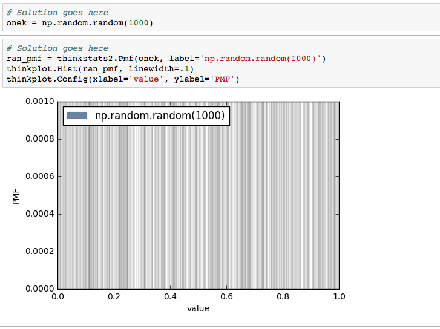
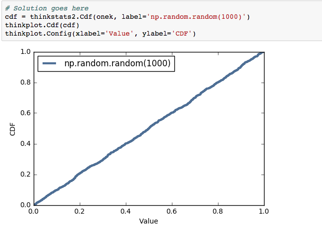

[Think Stats Chapter 4 Exercise 2](http://greenteapress.com/thinkstats2/html/thinkstats2005.html#toc41) (a random distribution)

>> the PMF function shows that some values are picked and others aren't. This seems right for a random list. I'm not entirely clear what is wrong with the visualization shown, except that the chapter says PMFs can't handle larger values well. Certainly the graph isn't easy to read, which is perhaps the point.

>> The CDF function is much easier to read. It is linear, suggesting that the random function works decently. Is it truly random? I'm not sure, in reading online it sounds like that is a hard question to answer. I'd guess probably not based on it not being 100% linear but I'm not entirely sure.

## See graphs below:

  

