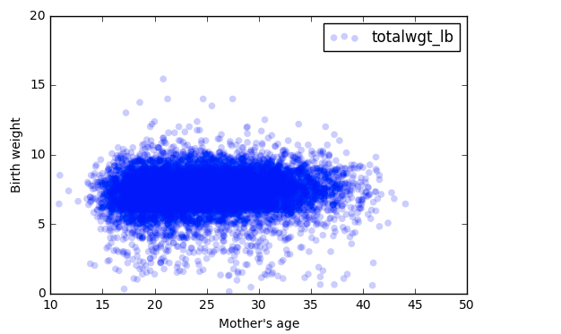
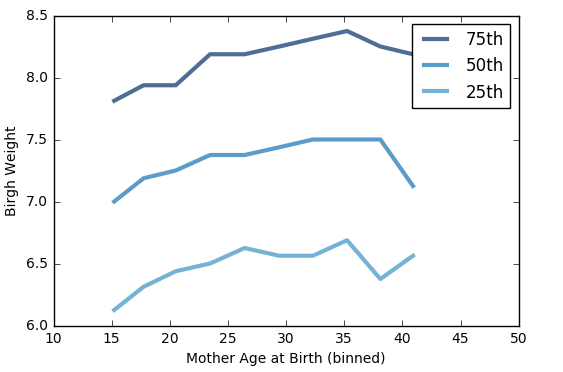

[Think Stats Chapter 7 Exercise 1](http://greenteapress.com/thinkstats2/html/thinkstats2008.html#toc70) (weight vs. age)

>> The Pearson correlation is 0.0688339703541. The Spearman rank correlation is 0.0946100410966.This shows that there is a minor correlation that is likely non-linear as Spearman is higher. You can also see that in the graphs below where the percentiles are not linear.

## Scatter plot of birth weight vs. mother's age

## Percentile graph of birth weigh vs. mother's age (binned)

