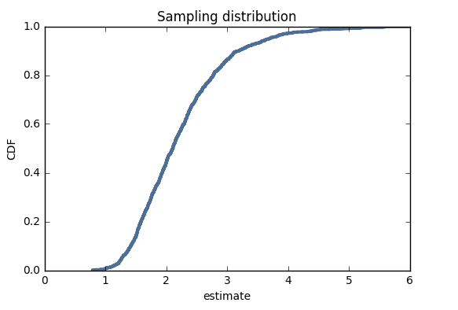
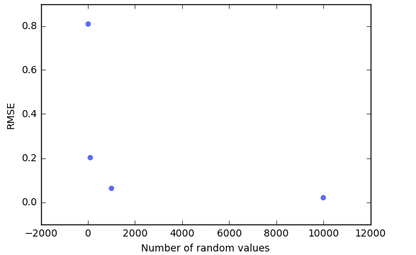

[Think Stats Chapter 8 Exercise 2](http://greenteapress.com/thinkstats2/html/thinkstats2009.html#toc77) (sample error)

*From the instructions: Communicate the problem, how you solved it, and the solution, within each of the following markdown files. (You can include code blocks and images within markdown.)*  

*Suppose you draw a sample with size n=10 from an exponential distribution with λ=2. Simulate this experiment 1000 times and plot the sampling distribution of the estimate L. Compute the standard error of the estimate and the 90% confidence interval.*  

*Repeat the experiment with a few different values of n and make a plot of standard error versus n.*  

## Answer

>> This problem asks you to look at standard errors and confidence intervals for a experiment you simulate 1000 times from an exponential distribution with a lambda of 2.  

>> To answer this question I created an estimation function that created samples of n values iters times (n=10, iters=1000). I got the confidence interval with a CDF I created and the cdf.Percentiles method. I created a CDF plot to plot the sampling distribution, then calculated the RMSE using the RMSE function from the book. Then I called this function with several different ns and graphed those. As the n's grow, the RMSE approaches 0.

>> rmse L 0.798727941575  
90% CI =  (1.2648085162475844, 3.6924554441891644)

>>See below for graph of standard error vs. n

## Sampling distribution: Standard Error vs. N

## Growing value for n shows RMSE appraoching 0

